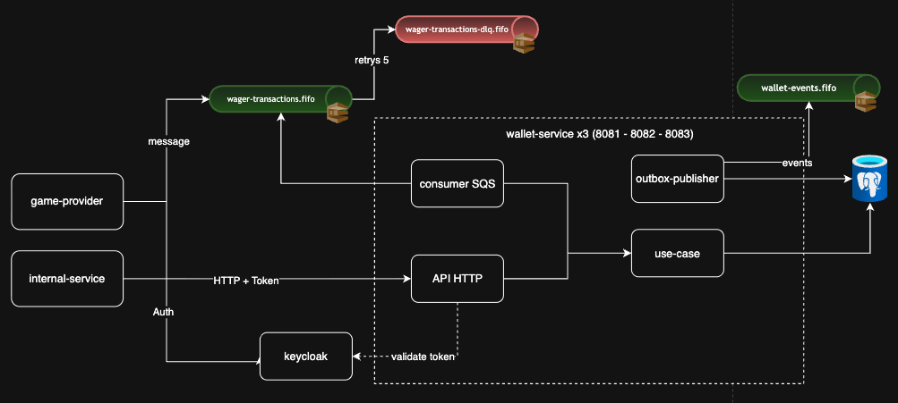
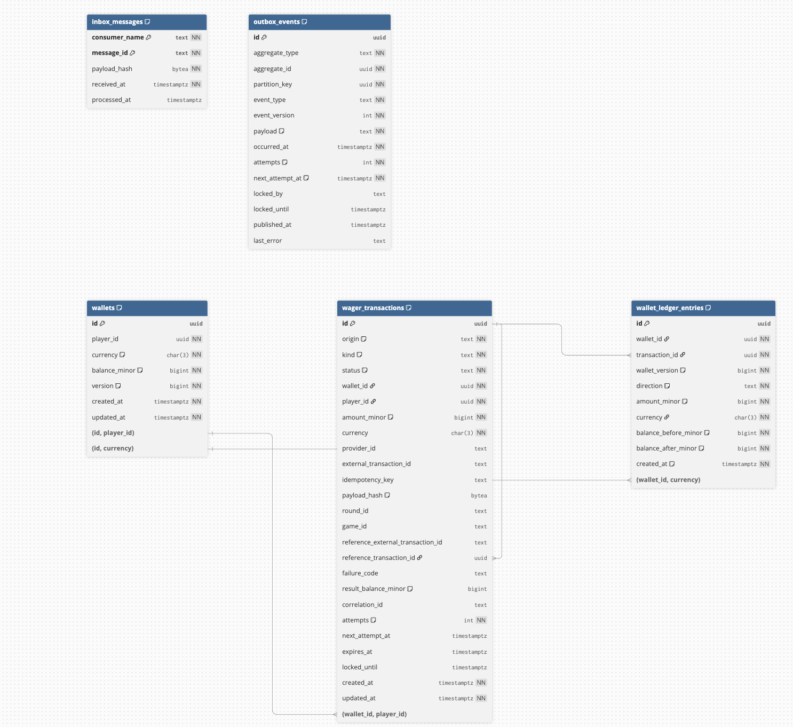

Olá bom dia, boa tarde ou boa noite, vai depender do horario de quem estiver lendo isso kkkkj

Curti o desafio do challenge, eu utilizei ele para bricar com algumas coisas, nele vamos utilizar por sua maioria a stdlib do priprio Golang cobrindo roteamento (net/http.ServeMux), logs JSON (log/slog) e testes.

O que não consegui resolver com a stdlib puxei externo, logico isso sem contar o que era obrigatorio.

Instruções de execução estão no [README.md](README.md).

## Uso de IA no desenvolvimento

No arquivo do challenge não especifica o uso de IA, então ela foi usada como ferramenta de apoio:

- **Claude Opus**: discussão e desenho da arquitetura.
- **Claude Sonnet**: implementação das tarefas, fase a fase.

O papel de arquiteto seguiu o prompt em [`.claude/software-architect.md`](.claude/software-architect.md), e as regras de código e de arquitetura que os agentes deviam respeitar estão em [`AGENTS.md`](AGENTS.md). Todas as decisões abaixo foram revisadas e validadas por testes contra o ambiente real (Postgres, Keycloak e LocalStack).

## Visão do projeto

Um único serviço Go, organizado em camadas (Clean/Hexagonal Architecture) e montado com Uber Fx, rodando em três réplicas idênticas e stateless no Docker Compose. Nenhum estado relevante fica em memória: tudo está no PostgreSQL ou no SQS, e o banco é o único ponto de coordenação entre as réplicas.

Cada réplica recebe operações por HTTP e pela fila `wager-transactions.fifo`, e roda três workers: o consumidor SQS, o publicador da outbox e o resolvedor de referências pendentes. HTTP e SQS montam o mesmo comando e chamam o mesmo caso de uso, então as garantias são idênticas nos dois canais.

## Tabelas e relacionamentos do banco de dados

**Se uma réplica morrer:**

- uma mensagem SQS ainda não apagada volta para a fila depois do visibility timeout e outra réplica a processa;
- eventos da outbox e referências pendentes estão sob lease; quando o lease vence, outra réplica assume;
- uma requisição HTTP em andamento falha, o provedor reenvia, e a idempotência torna o reenvio seguro;
- uma transação aberta é desfeita pelo Postgres, então nada fica gravado pela metade.

## Stack e dependências

| Necessidade | Biblioteca | Motivo |
|---|---|---|
| Composição | `go.uber.org/fx` | Obrigatório no desafio |
| Banco | `github.com/jackc/pgx/v5` | SQL explícito, como o enunciado prefere; expõe o SQLSTATE, usado para classificar erros |
| Fila | `aws-sdk-go-v2/service/sqs` | Não há cliente SQS na stdlib |
| Tokens | `github.com/coreos/go-oidc/v3` | Descoberta OIDC, cache e rotação do JWKS e validação do JWT; implementar isso à mão é risco de segurança |
| Migrations | `github.com/pressly/goose/v3` | Migrations versionadas com `up` e `down`, usadas pela CLI e pelos testes |
| Métricas | `prometheus/client_golang` | Formato padrão de exposição |
| Tracing (opcional) | OpenTelemetry SDK + exporter OTLP/HTTP | Propagação W3C e exportação em lote; visualização no Jaeger |
| IDs | `github.com/google/uuid` | UUIDv7, ordenado por tempo, melhor para índices B-tree |

## Dinheiro

`Money` guarda o valor em centavos (`int64`) junto com a moeda: `R$ 25,00` vira `2500`. Nenhum caminho monetário passa por `float32` ou `float64`, nem no parsing, nem na serialização.

- **Formato aceito:** apenas `"25.00"` (string, duas casas). E recusado qualquer outro formato
- **Moedas:** `BRL`, `USD` e `EUR`, todas com duas casas.
- **Persistência:** `amount_minor BIGINT` + `currency CHAR(3)`, que volta exatamente igual.

## Modelo de domínio

As entidades têm campos privados, construtores com validação e métodos explícitos de transição.

`Wallet.Debit` e `Wallet.Credit` devolvem o `LedgerEntry` correspondente, então não existe caminho que altere o saldo sem gerar o lançamento. 

Para garantir consistencia na wallet ela tem uma versão que começa em 1 e só sobe quando o saldo muda (`LOSS` não altera a versão).

### Estados de uma transação

| Estado | Significado | Terminal |
|---|---|---|
| `PENDING` | Recebida, em processamento | Não |
| `PENDING_REFERENCE` | Aguardando a transação referenciada | Não |
| `PROCESSED` | Concluída com sucesso | Sim |
| `REJECTED` | Recusada por regra de negócio | Sim |
| `FAILED` | Falha permanente de infraestrutura, registrada para auditoria | Sim |

`PENDING` existe apenas dentro da transação SQL e nunca é gravado. O único estado intermediário persistido é `PENDING_REFERENCE`, que tem retomada durável pelo resolvedor. Estados terminais são protegidos pelo domínio (`ErrTerminalState`) e por trigger no banco.

### Falha temporária, falha permanente e rejeição

| Tipo | Exemplos | Tratamento |
|---|---|---|
| Rejeição de negócio | Saldo insuficiente, referência inválida | Grava `REJECTED` com `failureCode`. É uma resposta válida, não um erro |
| Falha temporária | Conexão perdida, deadlock (`40P01`), serialização (`40001`), lock timeout (`55P03`), timeout | Rollback e até 3 novas tentativas. Persistindo: HTTP `503` com `Retry-After`; no SQS a mensagem volta para a fila |
| Falha permanente | Invariante quebrada, dado inconsistente (`22*`, `23*` inesperados) | Rollback e, numa transação separada, grava `FAILED`. HTTP `500`; no SQS a mensagem vai para a DLQ |

## Transação SQL

O caso de uso delimita a transação através da porta `UnitOfWork.Do(ctx, fn)`. Os repositórios recebem a mesma `pgx.Tx` e nunca abrem transação própria. Saldo, ledger, status da operação, inbox e eventos da outbox são gravados no mesmo commit, ou nada é gravado.

Sequência de uma operação:

1. Lê a carteira sem lock para validar existência e dono (jogador e moeda nunca mudam).
2. `INSERT` da transação com `ON CONFLICT DO NOTHING`. Se já existir, é um replay ou um conflito, e a carteira nem chega a ser travada.
3. `SELECT ... FOR NO KEY UPDATE` na carteira.
4. Resolve a referência (se houver) e aplica a regra no agregado.
5. Atualiza saldo e versão, insere o lançamento, atualiza o status e grava os eventos na outbox.
6. `COMMIT`. Uma constraint trigger adiada confere aqui que toda mudança de saldo tem o lançamento correspondente.

## Concorrência

A coordenação é por carteira, com lock de linha. Não há lock global, mutex em memória nem advisory lock.

No cenário do enunciado (carteira com 100.00 e duas apostas simultâneas de 80.00 em réplicas diferentes), a primeira operação trava a carteira, debita e faz commit. A segunda espera o lock, lê o saldo de 20.00 e é gravada como `REJECTED INSUFFICIENT_FUNDS`. Resultado: um débito no ledger e saldo final 20.00.

Envios duplicados da mesma operação são um problema diferente e não dependem do lock: são barrados pelos índices únicos de idempotência.

**Por que `FOR NO KEY UPDATE` e não `FOR UPDATE`:** ao inserir a transação, a FK pega `FOR KEY SHARE` na linha da carteira até o commit. `FOR UPDATE` conflita com esse lock, e duas operações na mesma carteira entravam em deadlock (`40P01`), o que foi reproduzido em teste de estresse. `FOR NO KEY UPDATE` continua exclusivo entre escritores e convive com `KEY SHARE`. É seguro porque as colunas-chave da carteira nunca mudam.

**Outras regras:**

- Isolamento `READ COMMITTED` com lock explícito; a reconciliação usa `REPEATABLE READ`.
- Ordem fixa de locks: carteira primeiro, depois as linhas de transação.
- `lock_timeout = 2s` e `statement_timeout = 5s`; estouro é tratado como falha temporária.
- Três barreiras contra lost update: o lock, o `UPDATE ... WHERE version = $lida` e o `CHECK (balance_minor >= 0)`.

## Idempotência

A idempotência é persistente e garantida por índices únicos:

| Situação | Detectada por | Resposta |
|---|---|---|
| Mesma chave e mesmo conteúdo | `UNIQUE (provider_id, idempotency_key)` + hash igual | Resultado gravado, `idempotentReplay: true` e o saldo observado na época |
| Mesma chave, conteúdo diferente | Mesmo índice + hash diferente | `409 IDEMPOTENCY_KEY_REUSED` |
| Mesma operação com outra chave | `UNIQUE (provider_id, external_transaction_id)` | `409 EXTERNAL_TRANSACTION_ID_CONFLICT` |
| Mensagem SQS reentregue | PK `(consumer_name, message_id)` da inbox | Mesmo hash: apaga a mensagem sem reprocessar. Hash diferente: DLQ |
| Mesma operação por HTTP e SQS | Os mesmos índices | Um único efeito financeiro |

O `provider_id` vem do token, então cada provedor tem seu próprio espaço de chaves. O servidor nunca substitui a `Idempotency-Key` recebida.

**Hash:** SHA-256 do JSON canônico (chaves ordenadas, sem espaços) com `providerId`, `externalTransactionId`, `playerId`, `walletId`, `roundId`, `gameId`, `kind`, `money.amount`, `money.currency` e `referenceExternalTransactionId` (só quando presente). Ficam de fora a chave de idempotência e metadados de transporte (`messageId`, `type`, `occurredAt`, headers). A única normalização é UUID em minúsculas. Como os dois canais montam o mesmo comando, o hash é igual por construção.

A deduplicação do SQS FIFO é apenas um filtro adicional (janela de 5 minutos); nenhuma garantia depende dela.

## Operações e reversões

| Tipo | Efeito | Regra |
|---|---|---|
| `BET` | Débito | Valor > 0 e saldo suficiente |
| `WIN` | Crédito | Valor > 0; referência opcional a uma `BET` da mesma rodada |
| `LOSS` | Nenhum | Valor exatamente `"0.00"`; sem ledger e sem mudar a versão |
| `REFUND` | Crédito | Referência a uma `BET` processada, mesmo valor |
| `ROLLBACK` | Inverso do original | Referência a `BET`, `WIN` ou `REFUND` processado, mesmo valor |
| `OPENING` | Crédito | Uso interno; recusado por HTTP e SQS com `KIND_NOT_ALLOWED` |

Operação e referência precisam concordar em provedor, jogador, carteira, moeda e rodada (`REFERENCE_MISMATCH`), e o valor precisa ser igual (`REFERENCE_AMOUNT_MISMATCH`).

**Política de reversões:** cada transação aceita no máximo uma reversão bem-sucedida, de qualquer tipo. A regra é imposta por um índice único parcial em `reference_transaction_id`.

| Sequência | Resultado |
|---|---|
| `BET` → `REFUND` → `ROLLBACK(BET)` | O `ROLLBACK` é rejeitado com `REFERENCE_ALREADY_REVERSED` |
| `BET` → `REFUND` → `ROLLBACK(REFUND)` | Aceito: o valor devolvido é debitado de novo e a aposta volta a valer |
| `ROLLBACK` de `ROLLBACK` | `INVALID_REFERENCE_KIND`, para não criar uma cadeia infinita |
| `ROLLBACK(WIN)` sem saldo | `REVERSAL_INSUFFICIENT_FUNDS`, diferente do `INSUFFICIENT_FUNDS` de uma aposta |

## Referências pendentes

Quando a referência ainda não existe, a operação é gravada como `PENDING_REFERENCE` com prazo de 10 minutos (configurável), junto com o evento `WagerTransactionPendingReference`. O HTTP responde `202`.

| Situação ao vencer o prazo ou ao resolver | Resultado |
|---|---|
| Referência não existe | `REJECTED REFERENCE_NOT_FOUND`, com evento de rejeição |
| Referência existe, mas também está pendente | Continua aguardando até o próprio prazo; vencido, `REJECTED REFERENCE_NOT_PROCESSED` |
| Referência terminou em `REJECTED` ou `FAILED` | `REJECTED REFERENCE_NOT_PROCESSED` |
| Referência processada, mas de tipo incompatível | `REJECTED INVALID_REFERENCE_KIND` |

## Proteções no banco

As invariantes valem mesmo que o código tenha um bug:

| Proteção | O que impede |
|---|---|
| `CHECK (balance_minor >= 0)` | Saldo negativo |
| `UNIQUE (player_id, currency)` | Duas carteiras para o mesmo jogador e moeda |
| `UNIQUE (wallet_id) WHERE kind = 'OPENING'` | Crédito inicial duplicado |
| `UNIQUE (wallet_id, transaction_id)` e `UNIQUE (wallet_id, wallet_version)` no ledger | Lançamento duplicado ou concorrente |
| `CHECK` no ledger: `after = before ± amount` | Lançamento com conta errada |
| `CHECK` de origem e de política de zero | Operação interna com campos de provedor; `LOSS` com valor ou `BET` com zero |
| Triggers de imutabilidade | `UPDATE`, `DELETE` e `TRUNCATE` no ledger; alteração de transação terminal; alteração do payload da outbox |
| Constraint trigger adiada em `wallets` | Mudança de saldo sem o lançamento correspondente |
| Papéis separados | `wallet_owner` é dono do schema; a aplicação usa `wallet_app`, sem permissão de alterar o ledger |

As migrations rodam num container `migrate` antes das réplicas, a aplicação não migra no boot

## Consumidor SQS

| Fila | Configuração |
|---|---|
| `wager-transactions.fifo` | Visibility timeout de 30s, long polling de 20s, redrive para a DLQ após 5 recebimentos |
| `wager-transactions-dlq.fifo` | Retenção de 14 dias |
| `wallet-events.fifo` | Destino dos eventos da outbox |

As filas e suas políticas são criadas por `deploy/localstack-init.sh` quando o LocalStack sobe.

**Contrato de envio:** `MessageGroupId = walletId`, o que garante ordem por carteira e paralelismo entre carteiras, e `MessageDeduplicationId = messageId`.

## Outbox e eventos

Os eventos são gravados em `outbox_events` na mesma transação da operação. Nada é publicado antes do commit.

O publicador roda em todas as réplicas: reserva até 50 eventos com `FOR UPDATE SKIP LOCKED` e lease, publica com `MessageGroupId = walletId` e `MessageDeduplicationId = eventId`, e marca `published_at` somente se ainda for o dono do lease. 

| Interrupção | Recuperação |
|---|---|
| Entre o commit e a publicação | O lease vence e outra réplica publica |
| Entre a publicação e a marcação | Outra réplica publica de novo com o mesmo `eventId` |

O `payload` é armazenado como `text` com validação JSON, e não como `jsonb`, porque `jsonb` reescreve o documento. Assim o SQS recebe exatamente os bytes gravados, o que mantém o snapshot imutável.

**Eventos:** `WagerTransactionProcessed`, `WagerTransactionRejected`, `WalletBalanceChanged` e `WagerTransactionPendingReference`, cada um com construtor próprio que fixa tipo e versão. O envelope contém `eventId`, `eventType`, `aggregateId`, `correlationId`, `causationId`, `occurredAt` (UTC, RFC 3339), `version` e `data`. Valores monetários são strings decimais.

## Autenticação e autorização

**IdP:** Keycloak implementa OIDC completo, roda localmente no Compose e é provisionado automaticamente pela importação de `deploy/keycloak-realm.json`. Cada cliente usa `client_credentials`.

**Validação do token** (middleware com `go-oidc`): assinatura via JWKS com cache e rotação, `iss`, `aud = wallet-api`, `exp`/`nbf` com 30s de tolerância e algoritmo restrito a `RS256`. Falhas resultam em `401` antes de qualquer acesso ao banco. Com o Keycloak fora do ar, as chaves em cache continuam validando tokens já emitidos.

| Cliente | Roles | Acesso |
|---|---|---|
| `provider-a`, `provider-b` | `wager:write`, `wager:read` | Enviar e consultar apenas as próprias transações |
| `wallet-internal` | `wallet:admin` | Carteiras, extrato e reconciliação |
| `provider-a-short` | Igual ao `provider-a`, com token de 5s | Teste de token expirado |

O `providerId` autorizado vem da claim `provider_id` do token. Se o corpo informar outro provedor, a resposta é `403` e nada é gravado. Consultas e replays são filtrados pelo provedor do token, e uma transação de outro provedor retorna `404`, para não revelar que ela existe.

## Uber Fx e shutdown

Cada área é um `fx.Module` (Telemetry, System, Observability, Postgres, OIDC, SQS, UseCase, HTTP, Outbox, Consumer, RefWorker), com injeção por construtor via `fx.Provide` e hooks de `fx.Lifecycle`. O `main.go` apenas chama `fx.New(...).Run()`.

**Inicialização:** configuração inválida impede o boot. Cada dependência é verificada antes de aceitar tráfego: ping no Postgres, `GetQueueUrl` das três filas e descoberta do Keycloak. O HTTP abre a porta de forma síncrona, então porta ocupada falha no boot. Cada worker tem contexto cancelável e um canal `done`.

**Shutdown (`SIGTERM`), na ordem inversa da inicialização:**

1. A readiness passa a responder `503`.
2. O servidor HTTP recusa novas conexões e conclui as requisições em andamento.
3. O consumidor para de buscar mensagens, conclui as em processamento em até 20s e devolve as demais com visibilidade 0.
4. O publicador e o resolvedor concluem o item atual e liberam os leases não usados.
5. O pool do Postgres fecha por último, depois que nenhum componente o utiliza.

## Observabilidade

- **Logs:** JSON com `correlationId`, `messageId`, `transactionId`, `walletId`, `providerId`, `traceId`, `status` e `failureCode`. Tokens, corpos de requisição e valores monetários não são registrados em `INFO`.
- **Métricas** (`/metrics`): resultado por status, replays, conflitos de idempotência, latência, retries do banco por SQLSTATE, espera de lock, mensagens SQS por desfecho (incluindo DLQ), backlog e idade da outbox, pendências abertas e divergências de reconciliação.
- **Health:** `/health/live` indica processo ativo; `/health/ready` verifica Postgres e as filas.
- **Opcionais implementados:** tracing com OpenTelemetry e Jaeger, e um dashboard no Grafana com Prometheus, Loki e regras de alerta.

## Testes

- **Unitários:** table-driven, com fakes mínimos e sem framework de mock.
- **Integração** (tag `integration`): Postgres, Keycloak e LocalStack reais do Docker Compose. Rodam também no CI.
- **Falhas** (tags `integration faultinject`): três processos reais do serviço, com pontos de interrupção (`os.Exit(137)`) antes do commit, depois do commit e antes do delete, depois da publicação e antes da marcação, e depois da reserva de uma pendência. O código de injeção não existe no binário de produção.

Ao final de cada teste, todas as carteiras são reconciliadas. Os comandos estão no README.

## Interpretações adotadas

- Operações sem dependência são síncronas; `PENDING` não é persistido.
- Valores monetários são aceitos apenas no formato exato `"25.00"`.
- Uma reversão por transação, de qualquer tipo (mais restritivo que o enunciado).
- `ROLLBACK` de `REFUND` reativa a aposta original.
- Um `WIN` com referência exige uma `BET` da mesma rodada e aguarda como pendente se ela ainda não chegou.
- O prazo de espera por referência é de 10 minutos.

### Códigos de falha

| Código | Natureza |
|---|---|
| `INSUFFICIENT_FUNDS`, `REVERSAL_INSUFFICIENT_FUNDS`, `CURRENCY_MISMATCH`, `REFERENCE_NOT_FOUND`, `REFERENCE_NOT_PROCESSED`, `REFERENCE_ALREADY_REVERSED`, `REFERENCE_MISMATCH`, `REFERENCE_AMOUNT_MISMATCH`, `INVALID_REFERENCE_KIND` | Definitivo: gravado como `REJECTED` |
| `VALIDATION_ERROR`, `INVALID_MONEY`, `MISSING_IDEMPOTENCY_KEY`, `KIND_NOT_ALLOWED`, `WALLET_NOT_FOUND`, `PLAYER_WALLET_MISMATCH` | Corrigível: nada é gravado e o provedor pode reenviar corrigido |
| `INTERNAL_INVARIANT_VIOLATION` | Falha permanente, gravada como `FAILED` |